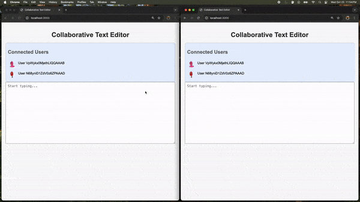

# Collaborative Text Editor

This project is a real-time collaborative text editor that allows multiple users to edit text simultaneously. The editor locks when a user focuses on it, preventing others from making changes until they unfocus or close the page. It also displays avatars for connected users and shows who is currently editing.

## Project Demo



## Features

- Real-time collaborative editing
- Document locking mechanism
- User avatars display
- Lock/unlock functionality
- User presence indication

## Technologies Used

- **HTML/CSS**: For structuring and styling the web application.
- **JavaScript**: For client-side interactivity and socket communication.
- **Socket.IO**: For real-time, bidirectional communication between clients and the server.
- **Node.js**: For the backend server.

## Installation

### Prerequisites

- Node.js
- NPM

### Setup

1. Clone the repository:

   ```bash
   git clone https://github.com/raodilip/CollaborativeTextEditor.git
    ```
2. Navigate to the project directory:

   ```bash
   cd CollobTextEditor
    ```

3. Install the required dependencies:

   ```bash
   npm install
    ```
4. Start the server:

   ```bash
   node server.js
    ```
5. Open the application:
Open your web browser and navigate to http://localhost:3000 to access the collaborative text editor.

## Usage

1. **Open multiple tabs in the same browser or different browsers.**:
   - You can open the same URL (`http://localhost:3000`) in multiple tabs or on different devices to test the collaborative features.

2. **Start Editing**:
   - Click inside the text area to start typing. The text area will lock for other users once you begin editing.

3. **See Real-Time Updates**:
   - As you type, other connected users will see your changes in real time. 

4. **View User Avatars**:
   - Each connected user will have a randomly generated avatar displayed, indicating their presence in the editor.

5. **Locking and Unlocking**:
   - If another user focuses on the text area, they will be locked out until you unfocus or close the page.


